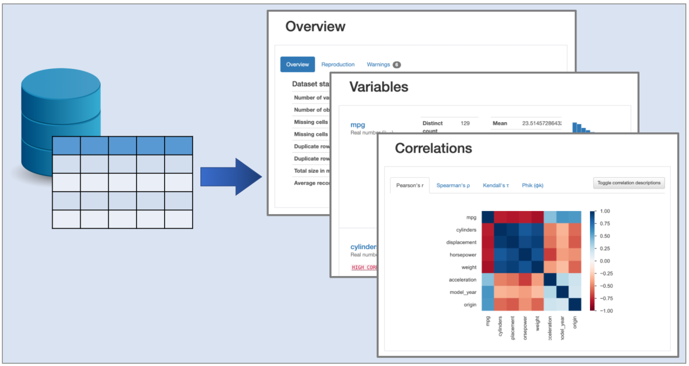
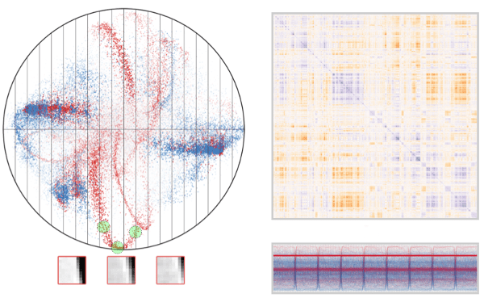

# Data Science (ML and Big Data tools)

This page collects ML methods. Focus is given to materials that have an applied focus rather than a theoretical one. For more theoretical materials, go to the [Basic Math] section.

## Data Exploration
* [Pandas Profiling](https://www.youtube.com/watch?v=Ef169VELt5o). A Python Library that automatizes the production of summary statistics from pandas data frames, similar to the summary() function in R, but with more output. Good for data exploration before running further analysis. Source code is available [here](https://github.com/ydataai/pandas-profiling). Further examples are [here](https://www.linkedin.com/pulse/summarizing-exploring-datasets-using-jupyter-notebooks-joseph-true/).

```{r, echo=FALSE, fig.align = 'center'}

```

## Correlation Methods

Calculating and visualizing the correlations in large multidimensional data sets is not trivial. This section explores techniques to calculate correlations.

* [An Alternative to the Correlation Coefficient That Works For Numeric and Categorical Variables](https://rama100.github.io/lecture-notes/x2y.nb.html).

* [s-Corrplot](https://mckennapsean.com/projects/s-corrplot/).
The s-CorrPlot is a scatterplot for visually exploring pairwise correlation coefficients between multiple variables in large datasets.

```{r, echo=FALSE, fig.align = 'center'}

```

* [Running Correlations in R](https://bookdown.org/chua/ber642_advanced_regression/running-correlations-in-r.html). A chapter on correlation from the Advanced Regression Methods course from the University of Alabama already mentioned in the [Statistics and Experimental Design] section. It covers "classical" correlation methods like Pearson's and Spearman's correlations, and more niche methods like Point Biserial Correlation, Phi Correlation, and Partial and Semipartial Correlation.

## Clustering Methods

* [Cluster Analysis in R: Practical Guide](https://www.datanovia.com/en/blog/cluster-analysis-in-r-practical-guide/). A compilation of clustering methods in R that includes some of the conceptual background that underpins them. 

