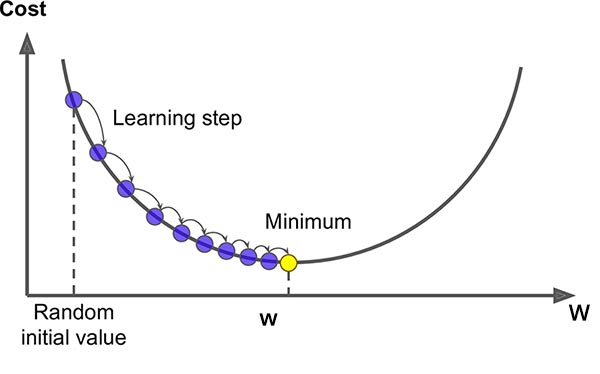

# Basic Math

This section cover some of the basic math that is necessary to understand Machine Learning Algorithms.

* [Paul's Online Notes](https://tutorial.math.lamar.edu/). Online notes prepared by Paul Dawkins from Lamar University. The material cover Linear Algebra, Trigonometry, Calculus, and Differential Equations.

* [Linear Algebra Cheat Sheet](pdfs/main_linear-algebra-cheat-sheet.pdf).

* [The Magic of Machine Learning: Gradient Descent Explained Simply but With All Math](https://itnext.io/the-magic-of-machine-learning-gradient-descent-explained-simply-but-with-all-math-f19352f5e73c). Gradient descent is the most common optimization algorithm used in Machine Learning methods, including Neural Networks. Any person wanting to understand and perform ML must have a basic understanding of this algorithm, even if just to chose a different optimization technique. This article covers the math behind the Gradient Descent algorithm without being overwhelming. Some basic understanding of Linear Algebra is necessary.

```{r, echo=FALSE, fig.align = 'center'}

```
