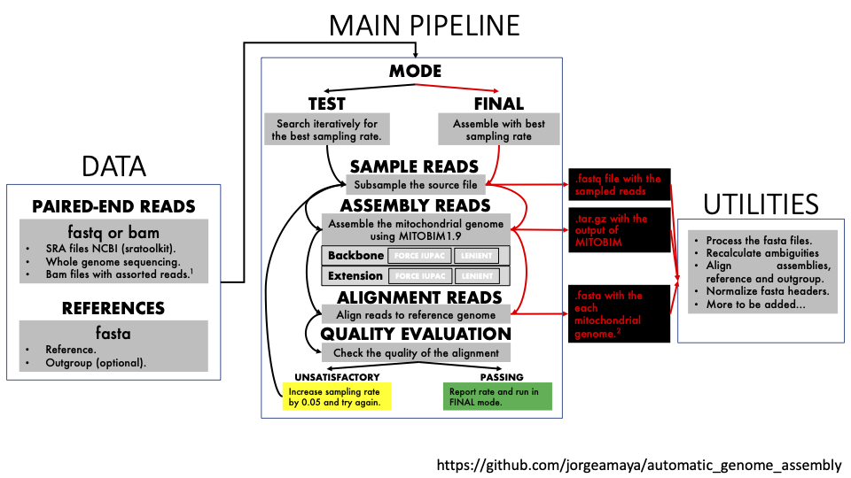

# Scientific Production and Outreach

This page compiles some of my own scientific production as well as papers and content created by people I collaborate with.

## Scientific Papers
* [Genome variation and population structure among 1142 mosquitoes of the African malaria vector species Anopheles gambiae and Anopheles coluzzii](http://m.genome.cshlp.org/content/early/2020/09/25/gr.262790.120). Anopheles gambiae 1000 Genomes Consortium. Genome Res. 2020 Oct;30(10):1533-1546. doi: 10.1101/gr.262790.120. Epub 2020 Sep 28. PMID: 32989001; PMCID: PMC7605271.

* [Joint inference of species histories and gene flow](https://www.biorxiv.org/content/10.1101/348391v3). Nicola F. Müller, Huw A. Ogilvie, Chi Zhang, Michael C. Fontaine, Jorge E. Amaya-Romero, Alexei J. Drummond, Tanja Stadler bioRxiv 348391; doi: [https://doi.org/10.1101/348391](https://doi.org/10.1101/348391)

## Pipelines
* [Pipeline for the distributed assembly of small genomic sequences](https://github.com/jorgeamaya/automatic_genome_assembly/wiki).

```{r, echo=FALSE, fig.align = 'center'}

```

## Youtube Videos and Postcast
* [Amazing Seagrass](https://www.youtube.com/channel/UC70Hu0jJygMmccbpZ6x_R8Q/videos). Simona's Youtube channel in which she reports on her Ph.D. thesis on Seagrass (genus *Zostera*).

```{r, echo=FALSE}
knitr::include_graphics("https://www.youtube.com/watch?v=OPLvZIIDAw0")
```