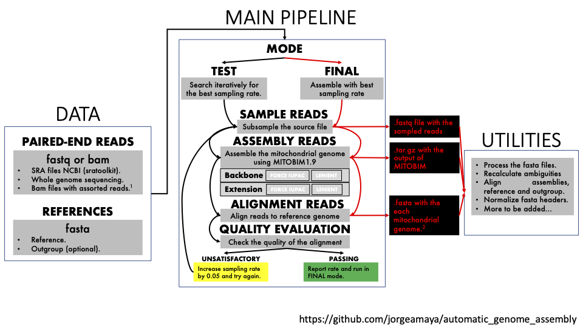

# Scientific production and outreach

## My scientific papers
* [Genome variation and population structure among 1142 mosquitoes of the African malaria vector species Anopheles gambiae and Anopheles coluzzii](http://m.genome.cshlp.org/content/early/2020/09/25/gr.262790.120).
* [Joint inference of species histories and gene flow](https://www.biorxiv.org/content/10.1101/348391v3).

## Pipelines
* [Pipeline for the distributed assembly of small genomic sequences](https://github.com/jorgeamaya/automatic_genome_assembly/wiki).
```{r, echo=FALSE}

```
